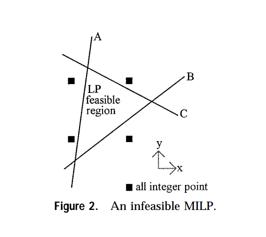

# Conflict Resolution Module
An implementation of a `conflictFinder` module based on the publication of Olivier et al. [1]
The main idea is to provide the python-mip library with a conflict dealing module

### TODO
#### IIS algorithms 
- [x] Implement Deletion Filter Algorithm (LP)
- [x] Implement Additive Algorithm (LP)

 

- [ ] Implement Deletion Filter Algorithm (IR-LC-BD) (MIPLP)
- [ ] Implement Deletion Filter Algorithm (LC-IR-BD) (MIPLP)

#### Relaxation module 
- [ ] Implement a linear punishment relaxation algorithm (based on a hierarchy structure)

#### References 
[1] [OLIVIER GUIEU AND JOHN W. CHINNECK 1998](http://www.sce.carleton.ca/faculty/chinneck/docs/GuieuChinneck.pdf)
 