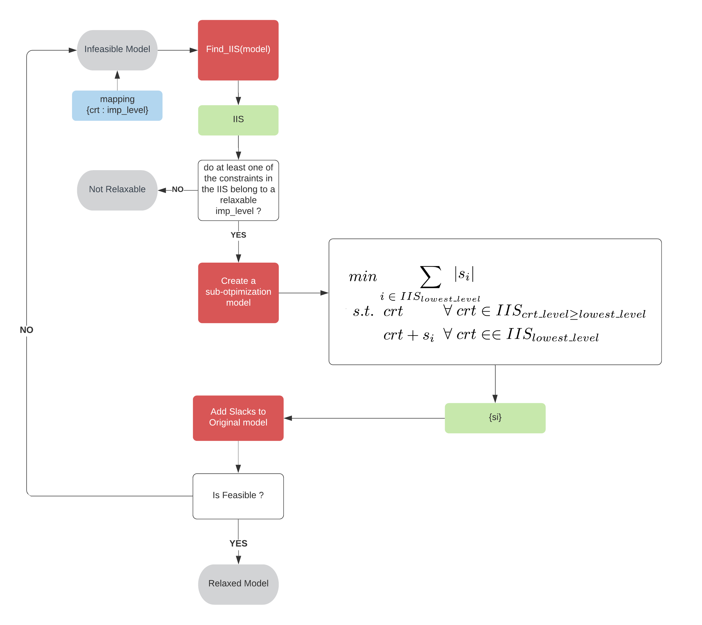

# Conflict Resolution Module
An implementation of a `ConflictFinder` module based on the publication of (OLIVIER GUIEU AND JOHN W. CHINNECK 1998) [1]. Also implement a `ConflictResolver` module that search and relax infeasibilities based on a constraint hierarchy defined by the user 

## Installation 

`pip install mip>=1.9.0`
Currently this is a separated module from the library, so you just need to import the `conflict.py`to your directory

## Usage
This module implements two classes `ConflictFinder` and the `ConflictResolver` class. the first one is an implementation of a few IIS finder algorithms and the second one is the implementation of a relaxation algorithm. 

### The `ConflictFinder` (The IIS finder)

#### tldr 

```
cf = ConflictFinder()
iis = cf.find_iis(model = my_infeasible_model, method='deletion-filter') # set of infeasible constraints
```
&nbsp;
####  long explanation
An IIS stands for Irreducible Infeasible Set of constraints. on a infeasible model you can have one or many infeasible sets, and some of them can be linked between them. Let's for example define a infeasible linear model with 4 constraints:

* `c1: x>=3`
* `c2: x<=1`
* `c3: y>=3`
* `c4: y<=1`

we can see that there are 2 IIS on the upper set  `IIS_1 = [c1,c2], IIS_2 = [c3,c4]`. This case is evident to see, that we only have two sets, but lets add a fifth constraint

* `c5: y>=4`

now we have a third IIS  `IIS_3 = [c4,c5]`, we can realized that the problem of finding all the infeasibilities needs to search all the combinations. And that is a hard problem, usually you just need to apply some relaxation algorithm once you are debugging so this class will only provide you a way to find one IIS. 

currently there are two methods implemented, `'deletion-filter'` and `'additive_algorithm'` **this two methods only work for linear infeasibilities**. mip infeasibilities (when the feasible region does not contain integer solutions) **are not supported yet**.


### The `ConflictResolver` (the hierarchy relaxation algorithm)

#### tldr 
All the constraints have a `_l{i}` in the crt.name where i is the level of importance `i` in `[1, ... , 7]`  where 1 is the lowest level, and 7 is the `mandatory_level`, that means that is never to be relaxed. 

```
# resolve a conflict
cr = ConflictResolver()
relaxed_model = cr.hierarchy_relaxer(infeasible_model, relaxer_objective = 'min_abs_slack_val' )

print(cr.iis_num_iterations)      # number of IIS iterations 
print(cr.iis_iterations)          # list of IIS iterations (constraintLists of each iteration)
print(cr.relax_slack_iterations)  # list of dicts with {crt:slack_value} on each IIS iteration 
print(cr.slack_by_crt)            # summary of all relaxation values (slacks) of all constraints when finished
```
####  long explanation

This algorithm is based on the `feasOpt` algorithm implemented on `cplex` basically it receives an infeasible `mip.Model` and a mapper of all constraints with certain level of `ConstraintPriority` (within 7 levels), currently the mapper automatically maps the all the constraints based on the names with the suffix `_l{i}`. It starts looking for an IIS and will relax it  minimizing the absolute value of the deviation of the lowest level constraints `s_{i}`. The image describes the function of the algorithm  



currently only the `min_abs_slack_val` is supported on the sub problem. But in the future we can add the min number of constraints relaxed or the sum of square value of the slack variables 
&nbsp;
&nbsp;
&nbsp;
&nbsp;
&nbsp;

## TODO
#### IIS algorithms 
- [x] Implement Deletion Filter Algorithm (LP)
- [x] Implement Additive Algorithm (LP) ([#2][i2])

 

- [ ] Implement Deletion Filter Algorithm (IR-LC-BD) (MIPLP)
- [ ] Implement Deletion Filter Algorithm (LC-IR-BD) (MIPLP)

#### Relaxation module 
- [x] Implement a linear punishment relaxation algorithm abs value(based on a hierarchy structure)
- [ ] Implement relaxation based on the minimization of the square of slack var value
- [ ] Implement relaxation based on the minimization of the number of constraints relaxed 
- [ ] Implement relaxation based on minimization of the number of constraints relaxed 


#### References 
[1]:http://www.sce.carleton.ca/faculty/chinneck/docs/GuieuChinneck.pdf 
[2]:https://github.com/pabloazurduy/python-mip-infeasibility/issues/2
